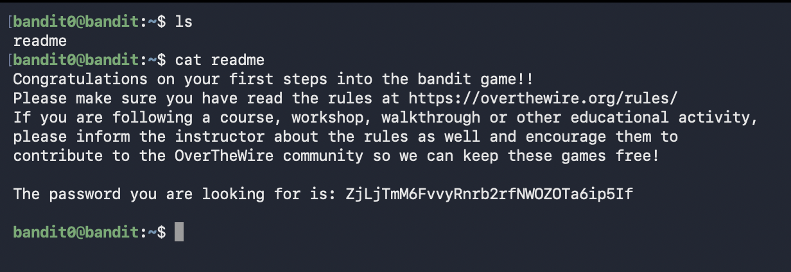

# Bandit Level 0 → Level 1

##  Goal (in my own words)

Connect to the Bandit server using SSH and find the file in my home directory that contains the password for the next level.

##  Connection details

- Host: `bandit.labs.overthewire.org`
- Port: `2220`
- Username: `bandit0`
- Auth: password shown on the Bandit website

## Commands I used

```bash
# Connect to the Bandit server on custom port 2220
ssh bandit0@bandit.labs.overthewire.org -p 2220

# List files in the home directory
ls

# Show the contents of the file that contains the password
cat readme
```

## Screenshot of level

# What i learned

Level 0 was simple, but it actually taught me a lot about how Linux really works.
Connecting with SSH finally clicked, it’s basically me “walking into” another computer through my terminal. Adding -p 2220 also showed me that not everything runs on the default port, so sometimes you have to point SSH to the right door.
Once I got in, ls and cat made more sense too.
ls is just a quick way to see what’s around me, and cat is the fastest way to read what’s inside a file.
It’s basic stuff, but it made me realise how much you can do with just a few simple commands in a remote environment.

