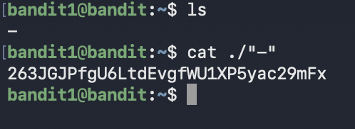

# Bandit Level 1 → Level 2

## Goal (in my own words)
Connect to the Bandit server as `bandit1` and find the password for the next level.  
The password is stored in a file literally named `-`, which acts differently from normal filenames.

---

## Connection details
- **Host:** bandit.labs.overthewire.org  
- **Port:** 2220  
- **Username:** bandit1  
- **Password:** ZjLjTmM6FvvyRnrb2rfNWOZOTa6ip5If  

---

## Commands I used
```bash
# Connect to the Bandit server
ssh bandit1@bandit.labs.overthewire.org -p 2220

# List files in the directory
ls

# Read the contents of the file named "-"
cat ./-
```
]


---


# Full explanation of level 1

##  What happened in Level 1  
The password file for Level 2 was named:

```
-
```

But `-` usually means **“read from standard input”**, not a filename.  
So running:

```bash
cat -
```

makes Linux wait for user input instead of opening the file.

To force Linux to read the actual file named `-`, you must use a path:

```bash
cat ./-
```

`./` tells Linux:

> “This is a real file in this folder, don’t interpret `-` as stdin or a flag.”

---

# Understanding Standard Input (stdin) 

### A program is like a person who needs information  
A program can get information in 2 ways:

1. **You hand it a file** (file input)  
2. **You talk to it directly** (typing → standard input)

So stdin literally means:

> **“The stuff being sent into the program right now.”**

That’s it.

### Analogy:
- **stdin** = a friend listening to you speak  
- **a file** = a friend reading something you handed them  

Linux needed ONE system to handle both situations.  
That system is stdin.

---

#  Why `-` means “use stdin”

Developers needed a tiny symbol that every program could understand to say:

> “Don't open a file, listen to what I'm typing.”

So they picked:

```
-
```

Example:

```bash
cat -
```

Means:

> “cat, read input from me (the user) instead of opening a file.”

This is why it waits instead of showing the password.

---

# Why Level 1 might be confusing
The file was literally named `-`.  
So when you type:

```bash
cat -
```

Linux thinks you meant stdin.  
Not the file.

To fix this, you must FORCE Linux to treat the dash as a file:

```bash
cat ./-
```

---

# Why `./` Works 

Linux decides what something means based on **where it appears**:

### Flags look like:
```
-l
-a
--help
```

### Filenames (paths) look like:
```
./file
../file
~/file
/path/file
```

Linux NEVER interprets paths as flags or stdin.  
So `./-` becomes a **literal file path**, not a special symbol.

This is why it works 100% of the time.

---

# Useful path shortcuts

| Symbol | Meaning |
|--------|---------|
| `.` | current directory |
| `..` | parent directory |
| `~` | home directory |
| `/` | root of the filesystem |
| `./file` | file in current directory |
| `../file` | file in parent directory |
| `~/file` | file in home directory |
| `/path/to/file` | absolute path |

### Memory trick:
- `.` = here  
- `..` = back  
- `~` = my home  
- `/` = top of everything  

---

# Other Ways to Open Weird Filenames

### 1. Using `--` to stop flag parsing:
```bash
cat -- -
```

### 2. Using absolute path:
```bash
cat /home/ubuntu/-
```

### 3. Using quotes (works sometimes):
```bash
cat '-'
```

But **`./-` is the cleanest and most universal.**

---


- `-` normally means “read from standard input.”
- Programs need stdin so they can accept input from typing or pipes.
- `cat -` = wait for user input.
- The Level 1 password file was literally named `-`.
- So you need a path to force Linux to treat it as a file:
  ```bash
  cat ./-
  ```
- Paths ALWAYS refer to files, never flags or stdin.
- Learning `.` `..` `~` `/` makes navigation predictable.

---
## What I learned
This level taught me how Linux treats special characters as filenames.

The file was named `-`, which usually means “read from standard input.”  
So running `cat -` doesn’t open the file — it waits for user input.

Adding `./` fixes this because it forces Linux to treat it as a literal filename:

```bash
cat ./-
```


