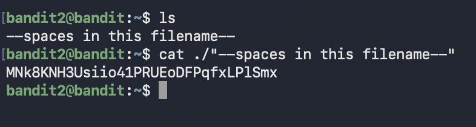

# Bandit Level 2 → Level 3

## Goal (in my own words)
Connect to the Bandit server as `bandit2` and find the password for the next level.  
The password is stored in a file named:

```
--spaces in this filename--
```

The challenge here is learning how to work with filenames that contain **spaces**, because normal commands break when you don’t handle the spaces correctly.

---

## Connection Details
- **Host:** bandit.labs.overthewire.org  
- **Port:** 2220  
- **Username:** bandit2  
- **Password:** (password from Level 1)  

---

##  What makes this level tricky
A filename with spaces behaves like **multiple separate arguments**.

If you try:

```bash
cat spaces in this filename
```

Linux thinks you're trying to open FOUR different files:

- `spaces`
- `in`
- `this`
- `filename`

You have to tell Linux:

> “These words belong together as *one* filename.”

---

## Commands I Used

### 1. Connect to Bandit 2

```bash
ssh bandit2@bandit.labs.overthewire.org -p 2220
```

### 2. List the files

```bash
ls
```

### 3. Correct way to read a filename with spaces

There are **two valid methods**:

---

### Method 1: Escape the spaces using backslashes

```bash
cat spaces\ in\ this\ filename
```

Each `\` tells Linux:

> “This space is part of the filename, do not split it.”

---

###  Method 2: Wrap the whole filename in quotes

```bash
cat "spaces in this filename"
```

Quotes force Linux to treat everything inside as **one argument** — not multiple words.



---

## What I Learned

This level teaches how Linux splits arguments using spaces.  
If a filename contains spaces, Linux treats each word separately unless you:

- **escape the spaces (`\`)**, OR  
- **wrap the entire filename in quotes**  

This is important because filenames in real Linux systems **can contain anything** , spaces, special characters, symbols.

Understanding how to reference them properly saves you from breaking commands or misreading file arguments.

In short:

> **Spaces break commands unless you escape them or quote them.**

---

