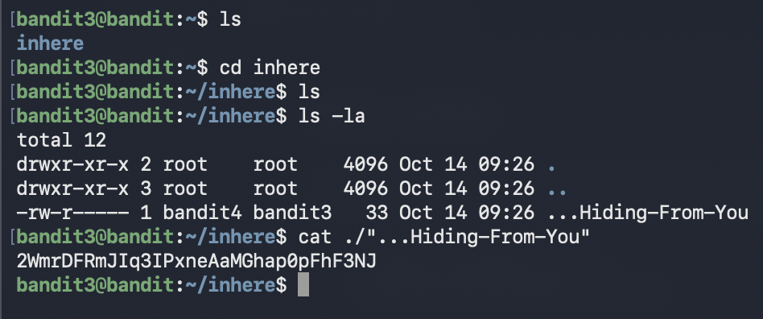

# Bandit Level 3 → Level 4

##  Goal (in my own words)
Connect as `bandit3` and locate the password for the next level.  
The password is stored inside a directory called **inhere**, and the file inside it is hidden.  
This level is all about learning how Linux handles directories, hidden files, and file paths.

---

##  Connection Details
- **Host:** bandit.labs.overthewire.org  
- **Port:** 2220  
- **Username:** bandit3  
- **Password:** (password from Level 2)

---

## Commands I Used

### 1. Connect to the server
```bash
ssh bandit3@bandit.labs.overthewire.org -p 2220
```

### 2. List the files in the home directory
```bash
ls
```

You’ll see a folder named **inhere**.

### 3. Move into that folder
```bash
cd inhere
```

### 4. Show everything inside (including hidden files)
```bash
ls -a
```

### 5. Read the hidden file
```bash
cat ./"...Hiding-From-You"
```

This prints the password.

---





---

## What I Learned

###  Directories are part of the file system  
`inhere` is just a folder, but getting into it using `cd` is crucial.  
Your **current working directory** changes how commands behave.

###  Hidden files start with a dot (`.`)  
A file like `.hidden` won’t show up with a normal `ls`.  
You need:

```bash
ls -a
```

Hidden files are everywhere in Linux systems (e.g., `.ssh`, `.config`, `.git`), so this matters.

###  Understanding paths prevents mistakes  
- `cd inhere` moves you **into** the folder  
- `ls` now shows what’s inside it  
- Commands always operate relative to where you currently are  

This level teaches you how to navigate the filesystem properly,a skill you’ll use everywhere in Linux and DevOps, and also how to read hidden files.

