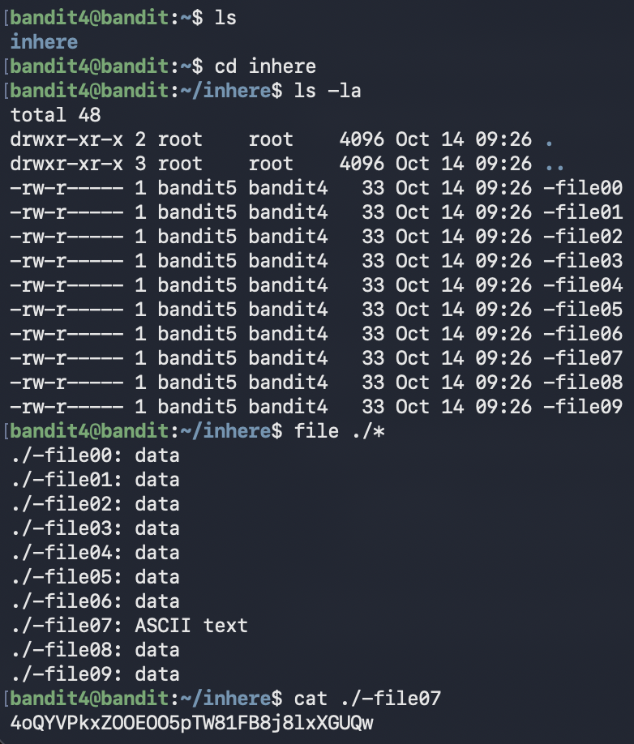

# Bandit Level 4 → Level 5

## Goal (in my own words)
Connect as `bandit4` and find the password hidden inside one of the files in the **inhere** directory.  
The catch: there are **10 files**, and only one of them is a **normal readable text file**.  
All the others are just random data.

This level teaches you how to identify file types and quickly scan through multiple files.

---

## Connection Details
- **Host:** bandit.labs.overthewire.org  
- **Port:** 2220  
- **Username:** bandit4  
- **Password:** (password from Level 3)

---

## Commands I Used

### 1. Connect to the server
```bash
ssh bandit4@bandit.labs.overthewire.org -p 2220
```

### 2. List the files
```bash
ls
```

You’ll see a folder called **inhere**.

### 3. Move inside the folder
```bash
cd inhere
```

### 4. Show everything (including hidden items)
```bash
ls -la
```

Inside the folder, you’ll see files named:

```
-file00 -file01 -file02 ... -file09
```

### 5. Identify which file is actually readable text
```bash
file ./*
```

The `file` command tells you the **type** of each file.

Only one should appear as:

```
ASCII text
```

In my case, it was:

```
./-file07: ASCII text
```

### 6. Read the file containing normal text
```bash
cat ./-file07
```

This prints the password.

---





---

##  What I Learned

### Not all files contain readable text  
Some files are “data,” meaning they’re binary or non-human-readable.  
Linux doesn’t care, everything is just a file.  
But **you** need to know which file is actually worth reading.

###  The `file` command is your detective tool  
Instead of opening 10 files one by one, `file` instantly tells you:

- which ones are text  
- which ones are binary  
- which ones have special formats  

This is extremely useful in real DevOps, security, and debugging tasks.

###  Special filenames starting with `-`  
Just like earlier levels, these filenames begin with a dash (`-`), so you must reference them safely:

```bash
cat ./-file07
```

Using `./` forces Linux to treat it as a literal filename, not a command flag.

###  Pattern matching with `./*`  
This lets you run a command on **every file** in the directory.

Example:

```bash
file ./*
```

It saves you tons of time and works even with weird filenames.

---

## Summary
This level is all about **working smarter, not harder**.  
Instead of manually checking each file, you use tools (`file`) and patterns (`./*`) to quickly identify the correct one and extract the password.

