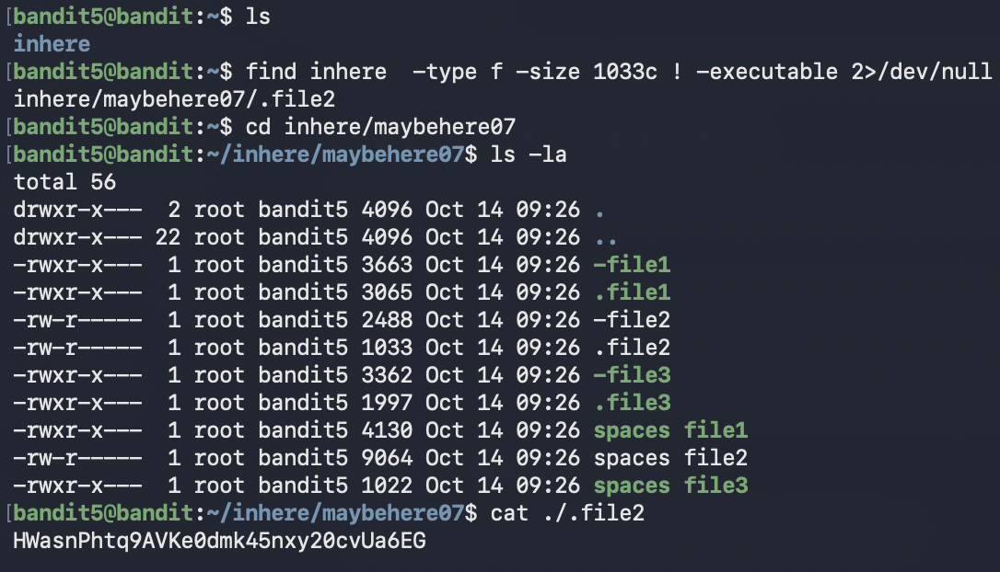

# Bandit Level 5 → Level 6

## Goal (in my own words)
Connect as `bandit5` and find the password for the next level.  
The password is hidden **somewhere inside the `inhere` directory tree** in a file that:

- is a **regular file**
- is **1033 bytes** in size
- is **not executable**

This level is all about learning how to use the `find` command properly.

---

##  Connection Details
- **Host:** bandit.labs.overthewire.org  
- **Port:** 2220  
- **Username:** `bandit5`  
- **Password:** (password from Level 4)

---

##  Commands I Used

### 1. Connect to the server
```bash
ssh bandit5@bandit.labs.overthewire.org -p 2220
```

### 2. See what’s in the home directory
```bash
ls
```

You’ll see a folder called:

```text
inhere
```

### 3. Use `find` to search ONLY inside `inhere`
```bash
find inhere -type f -size 1033c ! -executable 2>/dev/null
```

This returned something like:

```text
/home/bandit5/inhere/maybehere07/.file2
```

### 4. Read the password from the matching file
```bash
cat /home/bandit5/inhere/maybehere07/.file2
```

That prints the password for the next level.

---





---

##  What I Learned

This level was my first “real” use of `find` to filter files based on **multiple conditions**:

- location (`inhere`)
- type (`-type f`)
- size (`-size 1033c`)
- permissions (`! -executable`)

It also taught me how to:

- **avoid searching the entire system** (which returns loads of useless paths)
- **ignore “Permission denied” spam** using `2>/dev/null`
- think about how a command should be **structured** instead of randomly guessing flags

---

##  Deep Dive: Understanding the `find` Command

Here’s the exact command again:

```bash
find inhere -type f -size 1033c ! -executable 2>/dev/null
```

### General structure of a good `find` command

You can think of `find` as:

```bash
find <where>   <tests / filters>              <what to do>
     ^         ^                              ^
   path   conditions (type, size, perms)   (optional: action)
```

In this level:

- **`where`** → `inhere`  
- **tests** → `-type f -size 1033c ! -executable`  
- **action** → default is “print the matching paths”  
- `2>/dev/null` → hide error messages  

---

### Breaking down each part

#### 1. `find inhere`
Start searching **inside the `inhere` directory only**, not the whole system.

> Important: This avoids matching files in `/usr`, `/opt`, etc., which we don’t care about for this level.

---

#### 2. `-type f`
Filter to only **regular files**.

- `f` = file  
- `d` = directory  
- `l` = symbolic link  

So `-type f` means:

> “Ignore folders, symlinks, devices… only show actual files.”

---

#### 3. `-size 1033c`
Match files that are **exactly 1033 bytes**.

- `1033` = size
- `c` = bytes (think “c = characters”)

Other examples (for understanding):

- `-size 10k` → 10 kilobytes  
- `-size +1M` → bigger than 1 megabyte  
- `-size -500c` → smaller than 500 bytes  

Here we’re strict: `1033c` means **exactly** 1033 bytes.

---

#### 4. `! -executable`
The `!` means **NOT**.

So:

```bash
! -executable
```

means:

> “The file must **not** be executable.”

Spaces matter here:

- `! -executable` (correct)  
-  `!-executable` (wrong)  

`find` reads each piece as a separate argument, so the space is required.

---

#### 5. `2>/dev/null`
This part has nothing to do with the search filters, but it makes the output readable.

- `2>` = redirect **stderr** (error messages)
- `/dev/null` = the “black hole” of Linux (throw it away)

So:

```bash
2>/dev/null
```

means:

> “Send all error messages (like ‘Permission denied’) into /dev/null so I don’t see them.”

This is super useful when searching across directories where you don’t have permission for every subfolder.

---

##  Common Ways `find` Is Used (Cheat Sheet)

Here are some practical patterns that build on what this level taught me:

```bash
# Find all regular files under current directory
find . -type f

# Find all directories named "logs"
find . -type d -name "logs"

# Find files bigger than 10MB
find . -type f -size +10M

# Find all .log files and delete them (be careful!)
find . -type f -name "*.log" -delete

# Find all files owned by a specific user
find . -type f -user someuser

# Find non-executable files of a certain size
find . -type f -size 1033c ! -executable
```

And with error suppression:

```bash
find . -type f -size 1033c ! -executable 2>/dev/null
```

---

##  How I Now Think About `find`

Instead of guessing flags, I now set up `find` like this:

1. **Where do I want to search?**  
   → `find inhere` / `find .` / `find /var/log`

2. **What am I looking for?**  
   - Type? (`-type f` / `-type d`)  
   - Size? (`-size 1033c`, `+10M`, `-1k`)  
   - Name pattern? (`-name "*.log"`)  
   - Permissions? (`-executable`, `! -writable`)  

3. **Do I want to do something with the result?**  
   - Just print? (default)  
   - Delete? (`-delete`)  
   - Run another command on them? (`-exec <command> {} \;`)

4. **Do I need to hide permission errors?**  
   → add `2>/dev/null`

This level made `find` go from a scary command to a powerful filter that I can control.


