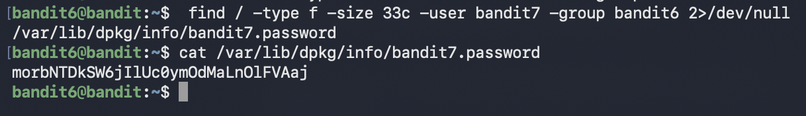

# Bandit Level 6 → Level 7

## Goal (in my own words)
Connect as `bandit6` and find the password for the next level.  
The password is located somewhere on the entire machine, not just one folder.  
We are told the file meets **three conditions**:

- owned by **user bandit7**
- owned by **group bandit6**
- **33 bytes** in size

This level teaches you how to use `find` with **ownership filters**, **size filters**, and how to control huge search results without drowning in “Permission denied” messages.

---

## 🔐 Connection Details
- **Host:** bandit.labs.overthewire.org  
- **Port:** 2220  
- **Username:** `bandit6`  
- **Password:** (password from Level 5)

---

## Commands I Used

### 1. Connect to the server
```bash
ssh bandit6@bandit.labs.overthewire.org -p 2220
```

### 2. Use find to search from the root directory `/`
```bash
find / -type f -user bandit7 -group bandit6 -size 33c 2>/dev/null
```

This returns something like:

```
/var/lib/dpkg/info/bandit7.password
```

### 3. Read the password
```bash
cat /var/lib/dpkg/info/bandit7.password
```

---





---

## 🧠 What I Learned

###  Searching the entire filesystem
Unlike earlier levels, this one requires searching **from the root (`/`)**, because the password file isn’t restricted to a home directory.

Using:

```bash
find /
```

means:

> “Start at the root and search EVERY folder.”

---

###  How to match file owners  
Linux files have:

- an **owner user**
- an **owner group**

We use:

```bash
-user bandit7
-group bandit6
```

Meaning:

> “Find files owned by user bandit7 AND group bandit6.”

This is extremely powerful in real SysAdmin/DevOps work, owners determine who’s allowed to read/write/execute files.

---

###  Matching exact file size  
The password file is exactly **33 bytes**.

We use:

```bash
-size 33c
```

`c` = bytes (think “characters”).

---

###  Removing “Permission denied” spam  
Searching the whole system triggers tons of errors:

```
find: /root/... Permission denied
find: /etc/... Permission denied
```

To hide this and keep your output clean:

```
2>/dev/null
```

- `2>` redirects **stderr**
- `/dev/null` throws it away

This keeps only the **successful matches**.

---

##  Deep Dive: Why this `find` command works so well

Here's the full command again:

```bash
find / -type f -user bandit7 -group bandit6 -size 33c 2>/dev/null
```

### BREAKDOWN:

| Part | Meaning |
|------|---------|
| `/` | search everywhere on the system |
| `-type f` | only regular files |
| `-user bandit7` | file owner must be bandit7 |
| `-group bandit6` | group owner must be bandit6 |
| `-size 33c` | file is exactly 33 bytes |
| `2>/dev/null` | hide errors |

### This is a good way to use `find`:

1. **Start point** → `/`  
2. **Filters** → type, owner, group, size  
3. **Output control** → stderr redirection  

That’s the structure of a *clean, thoughtful command.*

---

##  New Concepts Learned in This Level

###  1. Ownership matters  
Every file in Linux has:

- a user owner  
- a group owner  

`find` can filter by both, super useful in pentesting, DevOps, and system debugging.

---

###  2. Absolute paths  
Using:

```bash
find /
```

searches globally.  
Using:

```bash
cat /var/lib/dpkg/info/bandit7.password
```

uses an **absolute path**, meaning it doesn’t depend on your current working directory.

---

###  3. Understanding stderr redirection  
You now know that:

- `>` redirects standard output
- `2>` redirects errors
- `/dev/null` is a black hole that discards anything

Example:

```bash
find / 2>/dev/null
```

= run find normally, but hide all errors.

---

## Summary

This level teaches you how to use `find` with **multiple filters at once**:

- location  
- type  
- owner  
- group  
- size  

…and how to clean your search results by redirecting errors so you only see what matters.

This is the kind of `find` usage real DevOps engineers use all the time when scanning systems, debugging permissions, or locating specific files.

