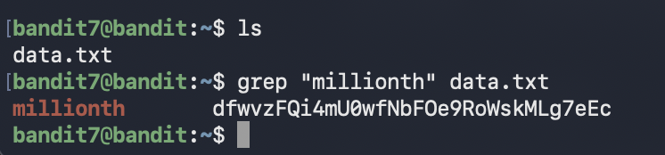

# Bandit Level 7 → Level 8

## Goal (in my own words)
Connect as `bandit7` and find the password for the next level.  
The password is stored in a file called `data.txt`, and the clue says:

"The password is next to the word 'millionth' in the file."

This level teaches how to search inside files efficiently using `grep`.

---

## Connection Details
- Host: bandit.labs.overthewire.org  
- Port: 2220  
- Username: bandit7  
- Password: (password from Level 6)

---

## Commands I Used

### 1. Connect to the server
```bash
ssh bandit7@bandit.labs.overthewire.org -p 2220
```

### 2. List the files
```bash
ls
```

You should see:

```
data.txt
```

### 3. Search for the line containing the word "millionth"
```bash
grep "millionth" data.txt
```

This prints something like:

```
millionth    <password_here>
```

### 4. Copy the password

That’s all that is required for this level.

---





---

## What I Learned

### Why `grep` is the correct tool
The file `data.txt` contains thousands of random lines. Reading manually is slow and pointless.  
The clue directs us to look for a specific word, so:

```bash
grep "millionth" data.txt
```

`grep` searches inside files and prints only the lines that contain matches.

This is one of the most commonly used commands in Linux for inspecting logs, debugging, filtering output, and automation.

---

### How grep is structured

```bash
grep <pattern> <file>
```

- `<pattern>` is what you want to look for  
- `<file>` is where you want to search  

Examples of useful variations:

```bash
grep "error" server.log
grep -i "warning" /var/log/syslog     # case-insensitive
grep -R "token" .                     # search recursively
```

---

### Why this level matters
This level teaches the importance of searching within large files instead of manually scanning them.

Practical skills learned here:
- Filtering text quickly
- Extracting only relevant information
- Using pattern-matching tools
- Working efficiently with large output

These are essential for DevOps, system administration, security, and troubleshooting.

---

## Summary
This level introduced:

- Searching inside files using `grep`
- Efficient text filtering
- Extracting a specific line from a large dataset

The key command used in this level:

```bash
grep "millionth" data.txt
```

