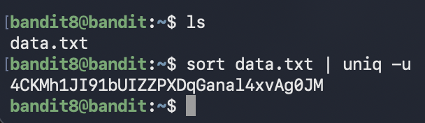

# Bandit Level 8 → Level 9

## Goal (in my own words)
Find the password for the next level.  
The clue states:

> The password is stored in `data.txt` and is the only line **that occurs once**.

This level teaches how to process text, identify unique lines, and use sorting and filtering tools.

---

## Connection Details
- Host: bandit.labs.overthewire.org  
- Port: 2220  
- Username: bandit8  
- Password: (password from Level 7)

---

## Commands I Used

### 1. Connect to the server
```bash
ssh bandit8@bandit.labs.overthewire.org -p 2220
```

### 2. List available files
```bash
ls
```

You should see:

```
data.txt
```

### 3. Find the line that appears only once
The file contains thousands of repeated lines. The password is the **only unique line**.

The most efficient pipeline:

```bash
sort data.txt | uniq -u
```

### Why it works
- `sort` groups identical lines together.
- `uniq -u` prints only the lines that appear **exactly once**.

This gives you the password.

---





---

## What I Learned

### How sorting and filtering pipelines work
Logs and datasets often contain huge amounts of repeated information. Instead of manually scrolling through thousands of lines, you can process and filter them using a chain of commands.

The structure looks like this:

```bash
command1 | command2 | command3
```

Each command receives input from the previous one.

### Breakdown of the pipeline

#### 1. `sort data.txt`
This rearranges the lines so duplicates are next to each other.

Example:
```
b
a
b
c
c
c
```

Becomes:
```
a
b
b
c
c
c
```

#### 2. `uniq -u`
`uniq` normally removes duplicate neighbors, but `-u` means:

> Show only the lines that appear once.

Using the earlier example:
```
a
b
b
c
c
c
```

`uniq -u` returns:
```
a
```

### Why this matters
This level introduces practical log-processing skills used constantly in real DevOps and Linux work:

- Finding patterns in large datasets  
- Cleaning noisy logs  
- Extracting one-off events  
- Building simple pipelines to automate filtering  

Core mental model:
> Sort first, then filter.

---

## Summary
This level focused on text processing and identifying unique lines by combining `sort` and `uniq`.

Key command:

```bash
sort data.txt | uniq -u
```

This outputs the password for Level 9.

