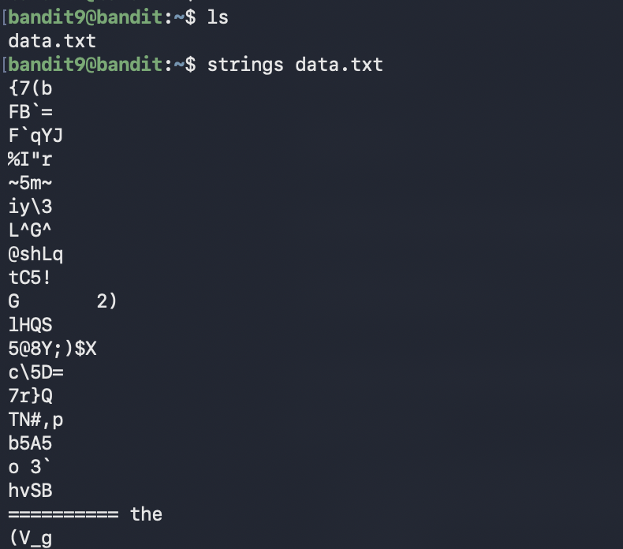

# Bandit Level 9 → Level 10

## Goal (in my own words)
Find the password for the next level.  
The password is stored in `data.txt`, but the file contains a lot of random binary noise.  
Among all that noise, there is **one human-readable string** hidden somewhere inside.

This level teaches how to detect readable text inside corrupted or binary files.

---

## Connection Details
- Host: bandit.labs.overthewire.org  
- Port: 2220  
- Username: bandit9  
- Password: (password from Level 8)

---

## Commands I Used

### 1. Connect to the server
```bash
ssh bandit9@bandit.labs.overthewire.org -p 2220
```

### 2. List the files
```bash
ls
```

You should see:

```
data.txt
```

### 3. Extract only the readable text from the file
```bash
strings data.txt
```

### 4. Look for a pattern that looks like a Bandit password  
Bandit passwords:
- Are usually 32–34 characters long  
- Use uppercase, lowercase, numbers  
- No spaces  

You scan the output and find the only string that matches the format.

---



the password is further down in the picture, cant fit it all, just showed the commands i used


---

## What I Learned

### Why `strings` works
Binary files contain:
- Random bytes  
- Bits that do not map to characters  
- Some bits that actually form readable ASCII text  

`strings` scans through the file and extracts any sequence of readable characters (default: 4 or more characters long).

If a file contains:
```
%29#@(*#@(*#@PASSWORDHERE293jjf#!#@*
```

`strings` will return:
```
PASSWORDHERE293jjf
```

### Why this matters
This level teaches a real-world debugging technique.  
You will see unreadable files everywhere in DevOps and Linux:

- corrupted logs  
- compressed output  
- binary blobs  
- compiled executables  
- unknown data formats  

`strings` is the fastest way to see if a file contains anything meaningful at all.

### The mental model  
Think of `strings` like a magnet you drag through a huge pile of metal and junk.  
It ignores everything useless and pulls out only the readable words.

### Optional: Filtering with grep
You can narrow the search if needed:

```bash
strings data.txt | grep -E '[A-Za-z0-9]{30,}'
```

This finds long alphanumeric strings, which is usually what Bandit passwords look like. Also gave another example of making your life easier further down.

---

## Summary
This level focused on extracting readable text from a noisy or binary file.  
The key command:

```bash
strings data.txt
```

This prints the only readable password hidden inside the file.
### A more efficient way to solve this level

Instead of manually scanning all the output from `strings`, I can filter it.

The level hint says the password is in a human-readable string **preceded by `=` characters**, so a better approach is:

```bash
strings data.txt | grep '='
```


